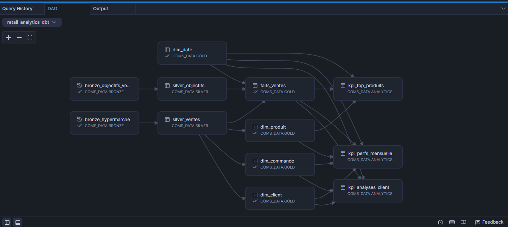

# Résumé du Projet - Retail Analytics DWH

## Vue d'Ensemble

**Projet**: Data Warehouse E-commerce avec DBT & Snowflake et Looker 
**Domaine**: Analyse des ventes retail multi-segments  
**Stack**: Snowflake + DBT + Azure Blob + Git + Looker 

---

## Données Sources

### Fichier 1: `hypermarche.csv` (Commandes)
**20 colonnes** incluant:
- **Identifiants**: ID ligne, ID commande, ID client, ID produit
- **Temporel**: Date de commande, Date d'expédition
- **Client**: Nom, Segment (Consumer/Corporate/Home Office), Ville, Région, Pays, Zone géographique
- **Produit**: Catégorie, Sous-catégorie, Nom
- **Métriques**: Montant ventes, Quantité, Remise, Profit
- **Logistique**: Mode d'expédition

### Fichier 2: `ventes.csv` (Objectifs)
**4 colonnes**:
- Catégorie
- Date de commande
- Segment
- Objectif de vente

---

## Architecture Implémentée
Schema étoile

# Dashboard => KPI Analytics sur Looker Studio
https://lookerstudio.google.com/reporting/845fc28d-1a8f-4076-a777-1b78b0813534

